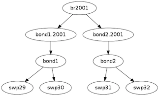
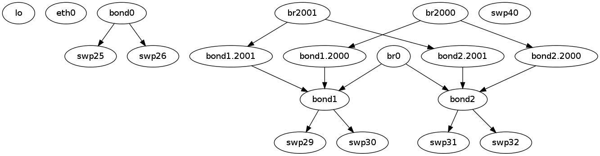

.. index:: ifupdown

.. _ifupdown:

**********
User Guide
**********

Keep the following points in mind before you start configuring interfaces using 
``ifupdown2``:

* IPv4 and IPv6 addresses for an interface can be listed in the same ``iface`` 
  section. For examples, see ``/usr/share/doc/python-ifupdown2/examples/``.

* Do not use a legacy interface alias. They are only supported for backward 
  compatibility with ``ifupdown``. They do get configured, but ``ifquery`` has 
  problems recognizing them.
  
* ``ifupdown`` only understands interfaces that were configured using 
  ``ifupdown``. Any interfaces created with a command other than ``ifupdown`` 
  (like ``brctl``) must be de-configured in the same manner.

* Use globs for port lists wherever applicable. Regular expressions work as well, 
  however regular expressions require all matching interfaces to be present in 
  the ``interfaces`` file. And declaring all interfaces in the ``interfaces`` 
  file leads to losing all the advantages that built-in interfaces provide.

* Extensions to ``ifquery`` help with validation and debugging.

* By default, ``ifupdown`` is quiet; use the verbose option ``-v`` when you want 
  to know what is going on when bringing an interface down or up.
  
Contents
========
* `Commands`_
* `Man Pages`_
* `Configuration Files`_
* `ifupdown Built-in Interfaces`_
* `ifupdown Interface Dependencies`_
* `Configuring IP Addresses`_
* `Specifying User Commands`_
* `Sourcing Interface File Snippets`_
* `Using Globs for Port Lists`_
* `Using Templates`_
* `Using ifquery to Validate and Debug Interface Configurations`_
* `Useful Links`_

Commands
========

* ifdown
* ifquery
* ifreload
* ifup

Man Pages
=========

* man ifdown(8)
* man ifquery(8)
* man ifreload
* man ifup(8)
* man ifupdown-addons-interfaces(5)
* man interfaces(5)

Configuration Files
===================

* /etc/network/interfaces

    
ifupdown Built-in Interfaces
============================

``ifupdown`` understands VLAN interfaces and physical interfaces that may appear
as dependents. There is no need to list them unless they need the specific
configuration or they need to match a regular expression used in the
``interfaces`` file. Use globs to avoid limitations with regular expressions.

For example, swp1.100 and swp2.100 below do not need an entry in the 
``interfaces`` file::

    auto br-100
    iface br-100
        address 10.0.12.2/24
        address 2001:dad:beef::3/64
        bridge-ports swp1.100 swp2.100
        bridge-stp on

ifupdown Interface Dependencies
===============================

``ifupdown`` understands interface dependency relationships. When ``ifup`` and
``ifdown`` are run with all interfaces, they always run with all interfaces
in dependency order. When run with the interface list on the command line, the
default behavior is to not run with dependents. But if there are any built-in 
dependents, they will be brought up or down.

To run with dependents when you specify the interface list, use the 
``--with-depends`` option. ``--with-depends`` walks through all dependents
in the dependency tree rooted at the interface you specify. Consider the
following example configuration::

    auto bond1
    iface bond1
        address 100.0.0.2/16
        bond-slaves swp29 swp30
        bond-mode 802.3ad
        bond-miimon 100
        bond-use-carrier 1
        bond-lacp-rate 1
        bond-min-links 1
        bond-xmit-hash-policy layer3+4

    auto bond2
    iface bond2
        address 100.0.0.5/16
        bond-slaves swp31 swp32
        bond-mode 802.3ad
        bond-miimon 100
        bond-use-carrier 1
        bond-lacp-rate 1
        bond-min-links 1
        bond-xmit-hash-policy layer3+4

    auto br2001
    iface br2001
        address 12.0.1.3/24
        bridge-ports bond1.2001 bond2.2001
        bridge-stp on

Specifying ``ifup --with-depends br2001`` brings up all dependents: bond1.2001, 
bond2.2001, bond1, bond2, bond1.2001, bond2.2001, swp29, swp30, swp31, swp32.

Similarly, specifying ``ifdown --with-depends br2001`` brings down all 
dependents: bond1.2001, bond2.2001, bond1, bond2, bond1.2001, bond2.2001, swp29, 
swp30, swp31, swp32. 

.. warning:: ``ifdown`` always deletes logical interfaces after bringing them 
   down. Use the ``--admin-state`` option if you only want to administratively 
   bring the interface up or down. In terms of the above example, 
   ``ifdown br2001`` deletes ``br2001``.

To guide you through which interfaces will be brought down and up, use the
``--print-dependency`` option to get the list of dependents.

Use ``ifup --print-dependency=list -a`` to get the dependency list of all 
interfaces::

    cumulus@switch:~$ sudo ifup --print-dependency=list -a
    lo : None
    eth0 : None
    bond0 : ['swp25', 'swp26']
    bond1 : ['swp29', 'swp30']
    bond2 : ['swp31', 'swp32']
    br0 : ['bond1', 'bond2']
    bond1.2000 : ['bond1']
    bond2.2000 : ['bond2']
    br2000 : ['bond1.2000', 'bond2.2000']
    bond1.2001 : ['bond1']
    bond2.2001 : ['bond2']
    br2001 : ['bond1.2001', 'bond2.2001']
    swp40 : None
    swp25 : None
    swp26 : None
    swp29 : None
    swp30 : None
    swp31 : None
    swp32 : None

To print the dependency list of a single interface, use::

    cumulus@switch:~$ sudo ifup --print-dependency=list br2001
    br2001 : ['bond1.2001', 'bond2.2001']
    bond1.2001 : ['bond1']
    bond2.2001 : ['bond2']
    bond1 : ['swp29', 'swp30']
    bond2 : ['swp31', 'swp32']
    swp29 : None
    swp30 : None
    swp31 : None
    swp32 : None

To print the dependency information of an interface in ``dot`` format::

    cumulus@switch:~$ sudo ifup --print-dependency=dot br2001
    /* Generated by GvGen v.0.9 (http://software.inl.fr/trac/wiki/GvGen) */
    digraph G {
        compound=true;
        node1 [label="br2001"];
        node2 [label="bond1.2001"];
        node3 [label="bond2.2001"];
        node4 [label="bond1"];
        node5 [label="bond2"];
        node6 [label="swp29"];
        node7 [label="swp30"];
        node8 [label="swp31"];
        node9 [label="swp32"];
        node1->node2;
        node1->node3;
        node2->node4;
        node3->node5;
        node4->node6;
        node4->node7;
        node5->node8;
        node5->node9;
    }

You can use ``dot`` to render the graph on an external system where ``dot`` is
installed.

To print the dependency information of the entire ``interfaces`` file::

    cumulus@switch:~$ sudo ifup --print-dependency=dot -a >interfaces_all.dot

.. note: The '--print-dependency' option is available with the ``ifup``, 
   ``ifdown`` and ``ifquery`` commands.

Configuring IP Addresses
========================

In ``/etc/network/interfaces``, list all IP addresses as shown below under the 
``iface`` section (see ``man interfaces`` for more information)::

    auto swp1
    iface swp1
        address 12.0.0.1/30
        address 12.0.0.2/30

The address method and address family are not mandatory. They default to 
``inet``/``inet6`` and ``static`` by default, but ``inet``/``inet6`` **must** be 
specified if you need to specify ``dhcp`` or ``loopback``.

You can specify both IPv4 and IPv6 addresses under the same ``iface`` section::

    auto swp1
    iface swp1
        address 12.0.0.1/30
        address 12.0.0.2/30
        address 2001:dee:eeef:2::1/64

Specifying User Commands
========================

You can specify additional user commands in the ``interfaces`` file. As shown in 
the example below, the interface stanzas in ``/etc/network/interfaces`` can have 
a command that runs at pre-up, up, post-up, pre-down, down, and post-down::

    auto swp1
    iface swp1
        address 12.0.0.1/30
        up /sbin/foo bar

Any valid command can be hooked in the sequencing of bringing an interface up or 
down, although commands should be limited in scope to network-related commands 
associated with the particular interface.  

For example, it wouldn't make sense to install some Debian package on ``ifup`` 
of swp1, even though that is technically possible. See ``man interfaces`` for 
more details.

Sourcing Interface File Snippets
================================

Sourcing interface files helps organize and manage the ``interfaces(5)`` file. 
For example::

    cumulus@switch:~$ cat /etc/network/interfaces
    # The loopback network interface
    auto lo
    iface lo inet loopback

    # The primary network interface
    auto eth0
    iface eth0 inet dhcp

    source /etc/network/interfaces.d/bond0

The contents of the sourced file used above are::

    cumulus@switch:~$ cat /etc/network/interfaces.d/bond0
    auto bond0
    iface bond0
        address 14.0.0.9/30
        address 2001:ded:beef:2::1/64
        bond-slaves swp25 swp26
        bond-mode 802.3ad
        bond-miimon 100
        bond-use-carrier 1
        bond-lacp-rate 1
        bond-min-links 1
        bond-xmit-hash-policy layer3+4
		
Using Globs for Port Lists
==========================

Some modules support globs to describe port lists. You can use globs to specify 
bridge ports and bond slaves::

    auto br0
    iface br0
        bridge-ports glob swp1-6.100

    auto br1
    iface br1
        bridge-ports glob swp7-9.100  swp11.100 glob swp15-18.100

Using Templates
===============

``ifupdown2`` supports Mako-style templates. For more information see
`www.makotemplates.org <http://www.makotemplates.org/>`_. The Mako template 
engine is run over the ``interfaces`` file before parsing.

Use the template to declare cookie-cutter bridges in the ``interfaces`` file::

    %for v in [11,12]:
    auto vlan${v}
    iface vlan${v}
        address 10.20.${v}.3/24
        bridge-ports glob swp19-20.${v}
        bridge-stp on
    %endfor

And use it to declare addresses in the ``interfaces`` file::

    %for i in [1,12]:
    auto swp${i}
    iface swp${i}
        address 10.20.${i}.3/24

Using ifquery to Validate and Debug Interface Configurations
============================================================

You use ``ifquery`` to print parsed ``interfaces`` file entries.

To use ``ifquery`` to pretty print ``iface`` entries from the ``interfaces`` 
file, run::

    cumulus@switch:~$ sudo ifquery bond0
    auto bond0
    iface bond0
        address 14.0.0.9/30
        address 2001:ded:beef:2::1/64
        bond-slaves swp25 swp26
        bond-mode 802.3ad
        bond-miimon 100
        bond-use-carrier 1
        bond-lacp-rate 1
        bond-min-links 1
        bond-xmit-hash-policy layer3+4

.. Use ``ifquery -a`` to pretty print all ``iface`` entries from the 
   ``interfaces`` file.

Use ``ifquery --check`` to check the current running state of an interface within 
the ``interfaces`` file. It returns exit code ``0`` or ``1`` if the configuration 
does not match::

    cumulus@switch:~$ sudo ifquery --check bond0
    iface bond0
            bond-mode 802.3ad  (✓)
            bond-miimon 100  (✓)
            bond-use-carrier 1  (✓)
            bond-lacp-rate 1  (✓)
            bond-min-links 1  (✓)
            bond-xmit-hash-policy layer3+4  (✓)
            bond-slaves swp25 swp26  (✓)
            address 14.0.0.9/30  (✓)
            address 2001:ded:beef:2::1/64  (✓)

.. note:: ``ifquery --check`` is an experimental feature.

.. Use ``ifquery --check -a`` to check all interfaces.

Use ``ifquery --running`` to print the running state of interfaces in the 
``interfaces`` file format::

    cumulus@switch:~$ sudo ifquery --running bond0
    auto bond0
    iface bond0
        bond-xmit-hash-policy layer3+4
        bond-miimon 100
        bond-lacp-rate 1
        bond-min-links 1
        bond-slaves swp25 swp26
        bond-mode 802.3ad
        address 14.0.0.9/30
        address 2001:ded:beef:2::1/64

``ifquery --syntax-help`` provides help on all possible attributes supported in 
the ``interfaces`` file. For complete syntax on the ``interfaces`` file, see 
``man interfaces`` and ``man ifupdown-addons-interfaces``.

``ifquery`` can dump information in JSON format::

    cumulus@switch:~$ sudo ifquery --format=json bond0
    {
        "auto": true, 
        "config": {
            "bond-use-carrier": "1", 
            "bond-xmit-hash-policy": "layer3+4", 
            "bond-miimon": "100", 
            "bond-lacp-rate": "1", 
            "bond-min-links": "1", 
            "bond-slaves": "swp25 swp26", 
            "bond-mode": "802.3ad", 
            "address": [
                "14.0.0.9/30",
                "2001:ded:beef:2::1/64"
            ]
        }, 
        "addr_method": null, 
        "name": "bond0", 
        "addr_family": null
    }

.. By default ``ifquery`` outputs information in the ``interfaces`` format. Some 
   options do take the ``--format`` option and can output in JSON format.

Useful Links
============

* `<http://wiki.debian.org/NetworkConfiguration>`_
* `<http://www.linuxfoundation.org/collaborate/workgroups/networking/bonding>`_
* `<http://www.linuxfoundation.org/collaborate/workgroups/networking/bridge>`_
* `<http://www.linuxfoundation.org/collaborate/workgroups/networking/vlan>`_

.. Caveats and Errata
.. ==================

